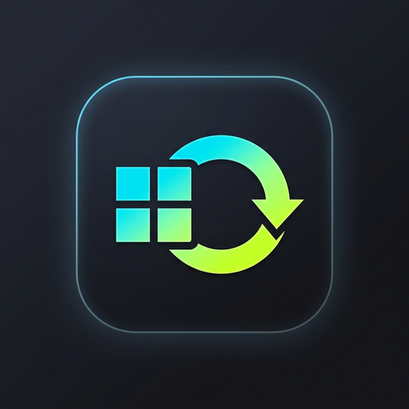

<p align="center">
  
</p>

# 🎞️ GifCreater Studio

<p align="center">
  <b>English</b> | <a href="README_zh.md"><b>简体中文</b></a>
</p>

<p align="center">
  <a href="https://github.com/HanboyLee/GifCreater/releases/tag/latest"></a>
  
  
  
  
  
  
</p>

A modern, standalone desktop studio engineered for unpacking AI multi-frame storyboards and generating premium animated GIFs and WebPs, built with PyQt6 and Windows 11 Fluent Design.

Effortlessly slice multi-panel art generated by Midjourney, Stable Diffusion, Flux, or DALL-E (2×2, 4×4, 3×3, or arbitrary grid configurations). Seamlessly create animations with **Projection Profile Valley Center Snapping**, an interactive **Free Caption Studio**, and a comprehensive **Multi-Platform Export Matrix**.

---

## ⚡ Streamlined Production Flow (Workflow)

```text
📥 Drop Multi-Frame Image ➔ ⚡ Valley Centerline Snapping ➔ ✍️ Drag Caption / Rotate ➔ 🎞️ Filmstrip Frame Cull ➔ 🚀 Export WeChat / Xiaohongshu / WebP
```

---

## ✨ Key Capabilities

### 1. 🔲 Smart Slicing & Projection Profile Valley Snapping
- **Gutter Centerline Lock**: Analyzes whole-channel energy and grayscale variance profiles to detect panel gutters. Snaps cutlines strictly to the physical centerline of gaps, eliminating offset cuts on characters or panel edges.
- **Native Alpha Channel Support**: Prioritizes transparent voids for RGBA sprite sheets and sticker grids.
- **Instant Re-Alignment**: Drag-and-drop red dashed cutlines freely on the canvas, with one-click **`⚡ 智能吸附参考线` (Smart Align)** and **`↺ 均匀等分` (Uniform Grid)** resets.

### 2. ✍️ WYSIWYG Free Caption Studio
- **Direct Canvas Drag-and-Drop**: Drag text overlays directly on the canvas to customize position intuitively.
- **Omnidirectional Bicubic Rotation**: Full `-180° ~ 180°` smooth text rotation with preset angle shortcuts (-45°, -15°, 0°, +15°, +45°).
- **RGBA Dual-Color & Opacity Sliders**: Independent text fill and outline stroke customization with adaptive stroke thickness and automatic font fallback.
- **2×2 Style Template Grid**: One-click quick presets: **Classic Black/White**, **Neon Lime**, **Vibrant Red Alert**, and **Translucent Watermark**.
- **2×3 Compass Positioning Grid**: Fast alignment to Top-Left, Top-Center, Top-Right, Center, Bottom-Center, and Bottom-Right.

### 3. 📦 Multi-Platform Export Matrix
- **💬 WeChat Sticker Preset**: Guaranteed compliance with WeChat mobile limits ($\le 500\,\text{KB}$, $\le 240\,\text{px}$ max side, alpha preservation) via adaptive 5-stage palette reduction and multi-tier fallback compression.
- **📕 Xiaohongshu 3:4 Social GIF**: Proportional scaling to platform-recommended 1080px resolution.
- **🌟 Original High-Res GIF**: Uncompromised native dimensions and full color fidelity.
- **⚡ High-Efficiency WebP**: True 24-bit RGB with 8-bit Alpha, superior compression, and lightweight file size.

### 4. ⏱️ Frame Timing Fidelity & Boomerang Ping-Pong
- **100% Timing Fidelity**: Strictly respects configured frame delays (ms) and end pause intervals without arbitrary truncation.
- **GIF89a 10ms Quantization Protection**: Ensures delays align with 10ms steps and enforces a $\ge 20\,\text{ms}$ lower bound to avoid browser slowdown bugs.
- **Universal Boomerang Effect**: Seamless ping-pong loop sequence expansion (`[A, B, C, B]`) across all formats to eliminate unnatural jump cuts.

### 5. 🎨 Windows 11 Fluent Design & Centralized Theme System
- **Dark / Light Hot-Reload**: Built with `ThemeManager` and high-contrast design tokens; instant theme switching without contrast defects.
- **Elastic Workspace Splitter**: Interactive left canvas and right sidebar resize freely with responsive boundary constraints (320px ~ 480px).
- **Native Brand Integration**: Features the official "Minimalist Dual-State Geometric" logo with Windows `AppUserModelID` registration for taskbar branding.

### 6. 🎞️ Interactive Filmstrip Timeline
- Visual thumbnail strip of all extracted frames. Click **`❌`** on any frame to drop visual glitches or AI artifacts; the animation and export update in real time with instant undo support.

---

## 🚀 Download & Quick Start

### Option 1: Standalone Portable App (Windows x64) — Recommended
Get the latest pre-compiled green build directly from GitHub Releases:
- 📦 **[Download GifCreater-windows-x64.zip (Recommended)](https://github.com/HanboyLee/GifCreater/releases/download/latest/GifCreater-windows-x64.zip)**
- ⚡ **[Download GifCreater.exe (Standalone Executable)](https://github.com/HanboyLee/GifCreater/releases/download/latest/GifCreater.exe)**

> **No installation or Python environment required.** Extract and double-click `GifCreater.exe`. Output animations and split frames are automatically archived in the adjacent `output/` folder.

---

### Option 2: Run from Python Source (Cross-Platform)
Requires Python 3.10+ (tested on Python 3.11 & 3.13):

```bash
# 1. Clone repository
git clone https://github.com/HanboyLee/GifCreater.git
cd GifCreater

# 2. Install dependencies
pip install -r requirements.txt

# 3. Launch application
python main.py
```

---

## 🏛️ Architecture & Documentation Index

The project follows a strictly decoupled headless architecture protected by a $\ge 90\%$ test coverage gate:
- 🏛️ **[ARCHITECTURE.md](ARCHITECTURE.md)**: Architectural blueprints, directory hierarchy, and three-tier decoupling model
- 📖 **[docs/requirements.md](docs/requirements.md)**: Product Requirements Document (PRD) and baseline specs
- 📐 **[docs/design.md](docs/design.md)**: Technical design, valley snapping algorithms, and design token specs
- 🗺️ **[docs/roadmap.md](docs/roadmap.md)**: Long-term product roadmap (v3.5 Prompt Collector & Agent Engine)
- 🛡️ **[AGENTS.md](AGENTS.md)**: AI Agent Collaboration Protocol and TDD $\ge 90\%$ Quality Gate

---

## 📄 License

Distributed under the [MIT License](LICENSE).
