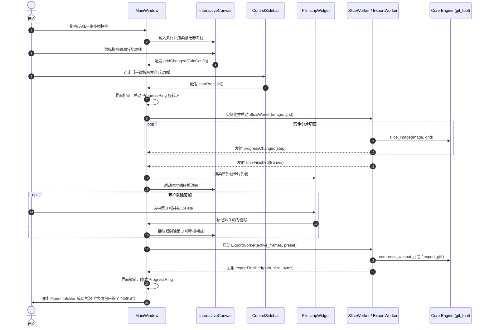

# 📐 GifCreater v3.0 详细设计方案说明书 (Detailed Design Specification)

> **文档定位**：v3.0 现代桌面客户端底层模块、类结构、信号拓扑与关键技术实现方案  
> **归档路径**：`spec/detailed_design.md`  
> **状态**：已实施交付 (Implemented & Delivered)  
> **关联规划**：[spec/v3_refactor_plan.md](file:///D:/gitfunFiles/GifCreater/spec/v3_refactor_plan.md) | [spec/execution_plan.md](file:///D:/gitfunFiles/GifCreater/spec/execution_plan.md)

---

## 一、 核心模块与类层级详细设计

系统遵循严格的“表现层 (UI) - 调度层 (Worker) - 核心引擎层 (Core) - 通用层 (Utils)”单向依赖模型：

```text
       ┌────────────────────────────────────────────────────────┐
       │                  src/gifcreater/ui/                    │
       │  MainWindow (FluentWindow)                             │
       │    ├── CanvasWidget (QGraphicsView)                    │
       │    ├── FilmstripWidget (QScrollArea)                   │
       │    └── SidebarWidget (QFrame)                          │
       └─────────────────────────┬──────────────────────────────┘
                                 │ 提交任务 / 监听信号
       ┌─────────────────────────▼──────────────────────────────┐
       │                  src/gifcreater/ui/workers.py          │
       │  SliceWorker / ExportWorker (QThread)                  │
       └─────────────────────────┬──────────────────────────────┘
                                 │ 函数调用 (纯 Python API)
       ┌─────────────────────────▼──────────────────────────────┐
       │                  src/gifcreater/core/                  │
       │  slicer.py / bounds.py / compressor.py / exporter.py   │
       └─────────────────────────┬──────────────────────────────┘
                                 │ 路径管理
       ┌─────────────────────────▼──────────────────────────────┐
       │                  src/gifcreater/utils/paths.py         │
       └────────────────────────────────────────────────────────┘
```

---

### 1. 核心算法引擎层 (`src/gifcreater/core/`)
*特点：纯无头（Headless）设计，零 Qt / GUI 模块依赖，纯 CPU 内存计算，100% 单元测试覆盖保护。*

#### (1) `slicer.py` (切片与网格计算引擎)
* **核心类/函数**：
  * `class GridConfig`：数据类，记录 `rows: int`、`cols: int`、`row_lines: List[int]`、`col_lines: List[int]`、`crop_bounds: Optional[Tuple[int,int,int,int]]`。
  * `calculate_default_grid(image_w: int, image_h: int, rows: int, cols: int, bounds: Optional[Tuple]) -> GridConfig`：根据行列与有效边界均匀初始化分割坐标。
  * `slice_image(image: Image.Image, grid: GridConfig, smart_crop: bool = True) -> List[Image.Image]`：执行切割，支持智能去除单帧黑边/白边，返回切片 PIL 图像列表。

#### (2) `bounds.py` (智能边界探测引擎)
* **核心函数**：
  * `detect_bounds(image: Image.Image, tolerance: int = 15) -> Tuple[int, int, int, int]`：自适应采样原图四角与边缘背景色，快速探测出画面实际主体的最大有效包围盒 `(left, top, right, bottom)`。

#### (3) `compressor.py` (微信表情包自适应压缩引擎)
* **核心函数**：
  * `compress_wechat_gif(frames: List[Image.Image], durations: List[int], max_size_bytes: int = 500 * 1024, max_side: int = 240) -> bytes`：
    1. 保持宽高比，将所有单帧等比缩放至最长边不超过 240px；
    2. 采用 PIL `ADAPTIVE` 调色板算法，依序试探 256 ➔ 128 ➔ 64 ➔ 32 色；
    3. 若仍然超标，在视觉容忍范围内适度降低每秒采样率或提升帧间隔（80~120ms），确保最终输出严格 `<= 500KB`。

#### (4) `exporter.py` (格式封装与写出)
* **核心函数**：
  * `export_gif(frames: List[Image.Image], durations: List[int], loop: int = 0, boomerang: bool = False) -> bytes`
  * `export_webp(frames: List[Image.Image], durations: List[int], loop: int = 0, boomerang: bool = False) -> bytes`
  * `save_to_disk(data: bytes, file_path: Path) -> Path`

---

### 2. 调度与异步线程层 (`src/gifcreater/ui/workers.py`)
*特点：利用 QThread 彻底隔离计算密集型任务，保障主界面事件循环（Event Loop）60 FPS 丝滑无阻。*

```python
class SliceWorker(QThread):
    # 信号定义
    progressChanged = pyqtSignal(int)          # 0 ~ 100 进度百分比
    stageChanged = pyqtSignal(str)             # 当前阶段描述（如 "正在切分第 3/16 帧..."）
    sliceFinished = pyqtSignal(list, object)   # 产出的 PIL Image 列表与 GridConfig
    sliceFailed = pyqtSignal(str)              # 失败异常信息

class ExportWorker(QThread):
    progressChanged = pyqtSignal(int)
    stageChanged = pyqtSignal(str)
    exportFinished = pyqtSignal(str, int)      # 产物文件绝对路径与体积字节数
    exportFailed = pyqtSignal(str)
```

---

### 3. 表现层核心视窗与交互组件 (`src/gifcreater/ui/`)

#### (1) `main_window.py` (`MainWindow(FluentWindow)`)
* 继承自 `qfluentwidgets.FluentWindow`，自动实现 Windows 11 云母 (Mica) / 亚克力 (Acrylic) 材质；
* 维护应用核心状态机（`AppState`）：素材加载状态、原图、切片帧集、废帧掩码列表、当前播放帧索引；
* 挂载 Fluent 顶栏控件：深浅色主题切换开关、标题栏、系统操作按钮。

#### (2) `canvas.py` (`InteractiveCanvas(QGraphicsView)`)
* 采用 Qt 图形视图框架（Graphics View Framework）实现视口展示：
  * **原图图元 (`QGraphicsPixmapItem`)**：承载高清素材或当前播放帧；
  * **分割参考线图元 (`DraggableGridLine(QGraphicsLineItem)`)**：
    * 鼠标悬停变红并高亮，光标变为水平/垂直调整箭头（`Qt.CursorShape.SplitHCursor` / `SplitVCursor`）；
    * 鼠标拖动平滑修改网格位置，并具备边缘磁吸（Snap）吸附机制；
    * 坐标系映射：实时在 Scene 坐标系与图像真实像素坐标系之间无损换算。
  * **视口交互**：滚轮以鼠标为中心平滑缩放（Zoom In/Out），按住空格键平移（Pan）。

#### (3) `filmstrip.py` (`FilmstripWidget(QScrollArea)`)
* 底部水平胶卷容器：
  * **帧卡片 (`FrameCard(QFrame)`)**：展示单帧缩略图、序号（`#01`、`#02`）；
  * **交互操作**：
    * 悬浮右上角浮现红色 `✕` 删除按钮；
    * 支持点击选中、Ctrl / Shift 多选；
    * 响应键盘 `Delete` 快捷键批量剔除废帧；
    * 被剔除帧以灰色半透明或红色斜划线示意，并可一键“恢复”。

#### (4) `sidebar.py` (`ControlSidebar(QScrollArea)`)
* 右侧参数面板，采用 Fluent 现代组件构建：
  * **切片控制**：`SpinBox`（行/列数调节）、`SwitchButton`（智能去黑边开关）；
  * **动画节奏**：`Slider`（帧间隔 ms）、`Slider`（尾帧停留 ms）、`SegmentedWidget`（常规循环 / 乒乓往复 Boomerang）；
  * **预设目标**：`RadioButton` 组（🌟 原画高清 GIF、💬 微信表情包 ≤500KB、⚡ 高保真 WebP）；
  * **行动按钮**：`PrimaryPushButton`（一键拆解并合成动图）、`PushButton`（打开 output 目录）。

---

## 二、 完整交互流程与信号拓扑图



---

## 三、 路径与资产归档设计 (`src/gifcreater/utils/paths.py`)

* **目录收拢规则**：
  * 所有成品动图保存至：`output/gifs/<源文件名>_<预设>_<时间戳>.gif`
  * 所有切片单帧保存至：`output/frames/<源文件名>_frames/frame_01.png`
* **权限防御降级机制**：
  * 优先使用 `sys.executable` 所在目录下的 `output/`；
  * 若目录只读（如用户放在 `C:\Program Files` 下运行），自动静默降级至 `%USERPROFILE%\Pictures\GifCreater\output`，彻底避免崩溃。
